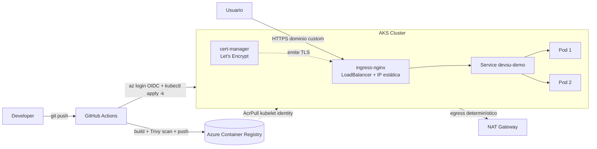
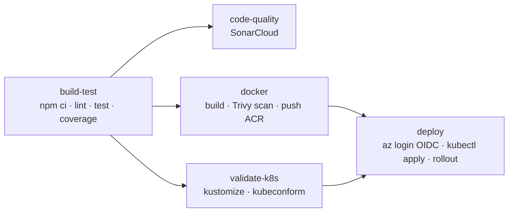

# Demo DevOps Node.js — Prueba Técnica

API REST de usuarios (Node.js 18 + Express + Sequelize/SQLite) **contenerizada, desplegada en Azure Kubernetes Service (AKS) mediante CI/CD, con infraestructura provisionada por Terraform (IaC modular), TLS con cert-manager/Let's Encrypt y DNS custom.**

Este documento es la entrega técnica: explica la arquitectura, las buenas prácticas aplicadas, los tiempos de ejecución y las decisiones de diseño (incluidos los trade-offs conscientes).

---

## Tabla de cumplimiento del reto

| Requerimiento | Estado | Dónde |
|---|:---:|---|
| Dockerfile multistage, non-root, healthcheck, expose, entrypoint | ✅ | [`Dockerfile`](Dockerfile) |
| Manifiestos de Kubernetes completos (probes, HPA, etc.) | ✅ | [`k8s/`](k8s/) |
| Pipeline CI/CD con todos los stages | ✅ | [`.github/workflows/ci-cd.yml`](.github/workflows/ci-cd.yml) |
| Análisis estático + cobertura + escaneo de vulnerabilidades | ✅ | SonarCloud + Jest coverage + Trivy |
| Manejo seguro de secretos (sin credenciales estáticas) | ✅ | OIDC federado con Azure |
| IaC modular con Terraform | ✅ | [`terraform/`](terraform/) |
| TLS/SSL + dominio custom | ✅ | cert-manager + Let's Encrypt + Azure DNS |
| Documentación con diagramas | ✅ | Este README |
| Escalamiento horizontal (HPA) | ✅ | [`k8s/base/hpa.yaml`](k8s/base/hpa.yaml) |

---

## Arquitectura



**Stack:** Node.js 18 · Express · Sequelize · SQLite · Docker · Kubernetes (AKS) · Kustomize · Terraform · GitHub Actions · Azure (ACR, AKS, DNS, Log Analytics).

---

## Contenerización (Docker)

[`Dockerfile`](Dockerfile) multistage con buenas prácticas:

- **Multistage build**: stage `deps` compila dependencias nativas (sqlite3 sobre Alpine/musl); el stage `runtime` solo copia `node_modules` ya construidos → imagen final mínima.
- **Usuario non-root** (`nodejs`, uid/gid 1001).
- **`tini`** como PID 1 → forwarding de señales y reaping de zombies (shutdown limpio).
- **HEALTHCHECK** integrado contra `/health/live`.
- **Variables de entorno** parametrizadas (`PORT`, `DATABASE_STORAGE`, `NODE_ENV`).
- **`.dockerignore`** excluye `node_modules`, tests, terraform, k8s, etc.

```bash
docker build -t devsu-demo-devops-nodejs:local .
docker run -p 8000:8000 devsu-demo-devops-nodejs:local
```

---

## Kubernetes

Manifiestos en [`k8s/`](k8s/), parametrizados con **Kustomize** (base + overlays para reutilización entre ambientes).

```
k8s/
├── base/          # deployment, service, ingress, hpa, pdb, configmap, secret,
│                  # serviceaccount, networkpolicy, namespace
├── overlays/
│   ├── local/     # imagen local
│   └── prod/      # imagen ACR + patch de Ingress con TLS
└── addons/
    └── cluster-issuer.yaml   # ClusterIssuer de cert-manager (Let's Encrypt)
```

**Buenas prácticas aplicadas:**

- **2 réplicas** + **HPA** (CPU 70% / memoria 80%, min 2 / max 10) → escalamiento horizontal.
- **3 probes**: `startupProbe`, `livenessProbe`, `readinessProbe`.
- **Rolling update** `maxUnavailable: 0, maxSurge: 1` → cero downtime.
- **Hardening de seguridad**: `runAsNonRoot`, `readOnlyRootFilesystem`, `drop ALL capabilities`, `seccompProfile: RuntimeDefault`, Pod Security Admission `restricted`.
- **PodDisruptionBudget**, **NetworkPolicy**, **ServiceAccount** dedicado sin automount.
- **ConfigMap** (config no sensible) + **Secret** (credenciales) separados.
- **Anti-affinity** para distribuir réplicas entre nodos.

```bash
kubectl apply -k k8s/overlays/prod
```

---

## CI/CD Pipeline

[`.github/workflows/ci-cd.yml`](.github/workflows/ci-cd.yml) — se ejecuta en push a `main`, PRs y tags.



| Stage | Qué hace |
|---|---|
| **build-test** | Instala deps, ESLint, Jest + cobertura, sube artifact de coverage |
| **code-quality** | SonarCloud (opcional: solo corre si existe el secret `SONAR_TOKEN`) |
| **docker** | Build de imagen, escaneo **Trivy** (SARIF a la pestaña Security), push a ACR con tags `latest` y `${sha}` |
| **validate-k8s** | Renderiza overlays con kustomize y los valida con kubeconform |
| **deploy** | `az login` (OIDC), credenciales de AKS, fija la imagen al digest construido, aplica y espera el rollout |

**Manejo seguro de secretos:** autenticación con **OIDC federado** (`azure/login@v2`) — **sin credenciales estáticas** en el repo. Solo 3 secrets en GitHub (`AZURE_CLIENT_ID`, `AZURE_TENANT_ID`, `AZURE_SUBSCRIPTION_ID`). El cluster jala la imagen vía rol **AcrPull** sobre la kubelet identity → sin `imagePullSecrets`.

> **Despliegue de infraestructura:** workflow separado [`.github/workflows/terraform.yml`](.github/workflows/terraform.yml) con `plan`/`apply`, estado remoto en Azure Storage y autenticación OIDC.

---

## Infraestructura como Código (Terraform)

IaC modular en [`terraform/`](terraform/) — 7 módulos reutilizables y parametrizados. Detalle completo en [`terraform/README.md`](terraform/README.md).

| Módulo | Recursos |
|---|---|
| `networking` | VNet + subnet del AKS |
| `gateway` | NAT Gateway + Public IP (egress determinístico) |
| `acr` | Azure Container Registry (admin off, solo AAD) |
| `aks` | Cluster AKS (CNI Overlay, Calico, autoscaler, OIDC, OMS agent) |
| `monitoring` | Log Analytics + Container Insights |
| `k8s-addons` | Helm: ingress-nginx + cert-manager |
| `dns` | Azure DNS zone + record A (hostname público del app) |

- **Estado remoto** en Azure Storage (`backend.tfvars`), parametrización por `environments/production.tfvars`.
- **IP pública estática** Terraform-managed asignada al ingress → el record DNS nunca apunta a una IP que pueda cambiar.

---

## Persistencia y consistencia de datos

> Esta sección documenta una **limitación arquitectónica conocida** y las decisiones tomadas al respecto.

### El comportamiento observado

La app usa **SQLite**, una base de datos basada en un **archivo local**. Con **2 réplicas**, cada Pod monta su propio volumen (`emptyDir`) y por lo tanto **su propia copia del archivo SQLite**. Como el `Service` balancea las peticiones entre ambos Pods, se observa lo siguiente:

```
POST /api/users  → atendido por Pod 1 → el usuario queda en la BD del Pod 1
GET  /api/users  → atendido por Pod 2 → responde []  (su BD no tiene ese dato)
GET  /api/users  → atendido por Pod 1 → responde [{...}]
```

Es decir, **una réplica puede devolver el valor y otra no**, de forma alternada. Esto es inherente a usar una base de datos de archivo local con múltiples réplicas; no es un bug del despliegue.

### Decisión aplicada — Opción A (mitigación de bajo costo)

Se corrigieron dos problemas reales del código base de la app:

1. **BD en memoria → BD en disco.** El código original configuraba SQLite con `host: process.env.DATABASE_NAME`, parámetro que SQLite **ignora**, por lo que la base caía a `:memory:` (se perdía todo al reiniciar). Se corrigió [`shared/database/database.js`](shared/database/database.js) para usar la opción correcta `storage` apuntando a `DATABASE_STORAGE` (`/data/dev.sqlite`, montado como volumen).
2. **`sync({ force: true })` → `sync()`.** El arranque borraba y recreaba las tablas en **cada inicio** del Pod ([`index.js`](index.js)). Se quitó el `force: true` para que los datos **persistan entre reinicios** del contenedor.

Con la Opción A, los datos ahora **persisten dentro del ciclo de vida de cada Pod** y dejan de perderse en cada reinicio.

### Lo que NO se hizo (y por qué) — trade-off consciente

La **consistencia total entre réplicas** (que cualquier Pod devuelva siempre el mismo dato) requiere un **almacenamiento compartido**, y la solución correcta de producción es una **base de datos externa gestionada**, p. ej. **Azure Database for PostgreSQL**. Esto satisface a la vez la Alta Disponibilidad (≥2 réplicas + HPA) **y** la consistencia.

**No se provisionó la base de datos PostgreSQL externa por una decisión deliberada de costos**: la suscripción de Azure utilizada para esta prueba no contempla el gasto recurrente de un servicio de base de datos gestionada. Se priorizó demostrar la arquitectura (IaC modular, AKS, CI/CD, TLS, DNS) manteniendo el consumo acotado.

> **Camino a producción documentado:** añadir un módulo Terraform `modules/postgres` (Azure Database for PostgreSQL Flexible Server), inyectar la cadena de conexión como `Secret`, y cambiar el dialecto de Sequelize a `postgres`. Con esto, las 2+ réplicas comparten el mismo estado y la inconsistencia descrita desaparece.

---

## DNS y TLS/SSL

- **ingress-nginx** expone el servicio vía LoadBalancer con **IP pública estática** (Terraform-managed, en el node resource group).
- **cert-manager + Let's Encrypt** (`ClusterIssuer` en [`k8s/addons/cluster-issuer.yaml`](k8s/addons/cluster-issuer.yaml)) emiten el certificado TLS automáticamente vía challenge HTTP-01.
- **Dominio custom**: un record **A** (`devsu-demo.andujaronline.uk`) apunta a la IP estática del ingress, en modo *DNS only* para permitir el challenge HTTP-01. El módulo `dns` de Terraform también puede crear la zona y el record en Azure DNS como alternativa IaC.

> Una vez que el dominio resuelve a la IP del ingress, cert-manager emite el certificado y la API queda disponible en `https://devsu-demo.andujaronline.uk/api/users` con candado válido.

---

## Tiempos de ejecución

### Provisionamiento de infraestructura (Terraform apply — medido)

| Recurso | Tiempo |
|---|---|
| Resource Group | 24 s |
| Azure Container Registry | 18 s |
| VNet + Subnet | ~9 s |
| NAT Gateway (+ Public IP + asociaciones) | ~30 s |
| Log Analytics + Container Insights | ~55 s |
| **AKS cluster** | **4 m 42 s** |
| Role assignment AcrPull | 24 s |
| cert-manager (Helm) | 24 s |
| ingress-nginx (Helm + provisión del LoadBalancer) | ~3–5 min |
| **Total aproximado** | **~12–15 min** |

### Pipeline CI/CD (GitHub Actions)

| Job | Tiempo aprox. |
|---|---|
| build-test | _(completar desde la pestaña Actions)_ |
| code-quality (Sonar) | _(completar)_ |
| docker (build + scan + push) | _(completar)_ |
| validate-k8s | _(completar)_ |
| deploy | _(completar)_ |

> Los tiempos del pipeline se adjuntarán con evidencia (screenshots) de las corridas reales en GitHub Actions.

---

## API — Contrato

Base path: `/api/users`. Health: `/health/live`, `/health/ready`.

### Crear usuario — `POST /api/users`

```json
{ "dni": "1234567890", "name": "Nombre" }
```
Respuesta `201`:
```json
{ "id": 1, "dni": "1234567890", "name": "Nombre" }
```
Errores: `400` si el DNI ya existe o el payload es inválido.

### Listar usuarios — `GET /api/users`

```json
[ { "id": 1, "dni": "1234567890", "name": "Nombre" } ]
```

### Obtener usuario — `GET /api/users/{id}`

`200` con el usuario, o `404` si no existe.

---

## Ejecución local

```bash
npm install
npm run test          # tests unitarios (Jest)
npm run test:coverage # con cobertura
npm run lint          # ESLint
npm run start         # http://localhost:8000/api/users
```

---

## Mejoras posibles / Próximos pasos

1. **Base de datos externa gestionada** (Azure Database for PostgreSQL) para consistencia total entre réplicas — ver sección de persistencia. Es la mejora de mayor impacto.
2. **Multi-ambiente** (`develop` → staging, `main` → producción) con namespaces/overlays separados en el pipeline.
3. **Empaquetado con Helm** como alternativa a Kustomize para mayor reutilización/parametrización.
4. **External-DNS** para sincronizar automáticamente los hostnames del Ingress con la zona DNS.
5. **GitOps** (Argo CD / Flux) para despliegue declarativo desde el repo.
6. **Observabilidad**: dashboards y alertas sobre Container Insights / Prometheus + Grafana.

---

## Evidencia

> Se adjuntará evidencia de la API activa (capturas de `POST`/`GET`, certificado TLS válido en el navegador y tiempos de pipeline) una vez que el dominio resuelva a la IP del ingress.

---

## Licencia

Copyright © 2023 Devsu. All rights reserved.
